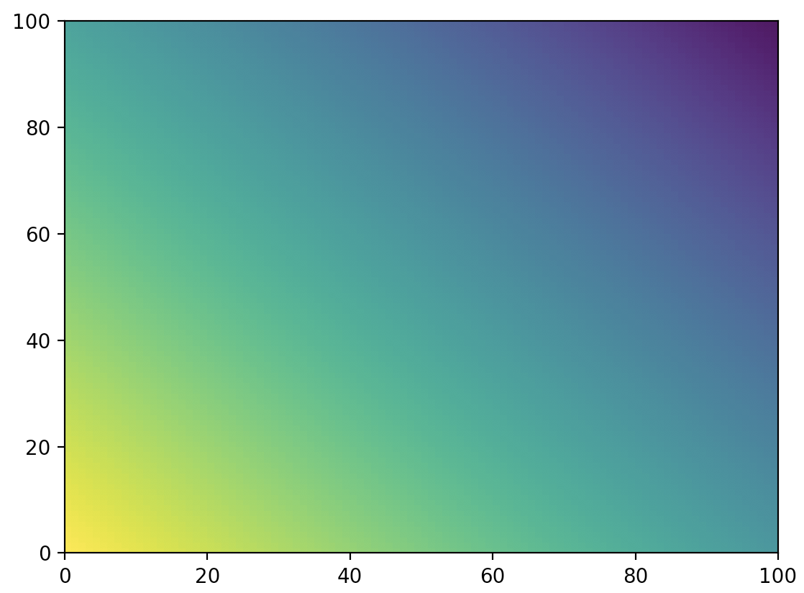

# Perceptron from Scratch

This repository shows how to program a Perceptron from scratch and how to train it.

### Setup
Install the requirements with the following command in your command line:

````pip install -r requirements````

### Start
Run the program with the following command in your command line:

````python start.py````

### Output

After running the program it will generate an output image which shows the perceptrons 
output. On Default, it gets 100x100 outputs of the perceptron from x and y starting at 0 and increasing to 1.

yellow = 1

purple = 0

